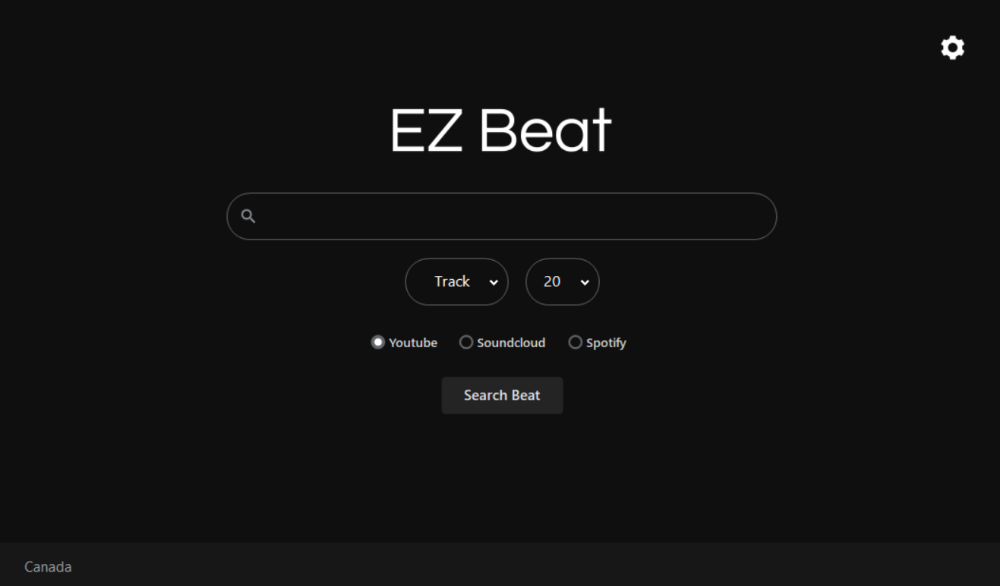

# EZBeat

## Table of Contents
- [About the Project](#about-the-project)
- [Features](#features)
- [Installation](#installation)
- [Usage](#usage)

## About the Project
EZBeat is an application made in VB.Net, to stream and download music in multiple formats.

## Features
- Stream music from popular platforms
- Download music in 3 different formats (WAV, MP3 and AAC)
- Filter by track and artist

## Installation
Download latest version

## Usage
- Choose your download path
- Choose the file format you want
- Start streaming!
